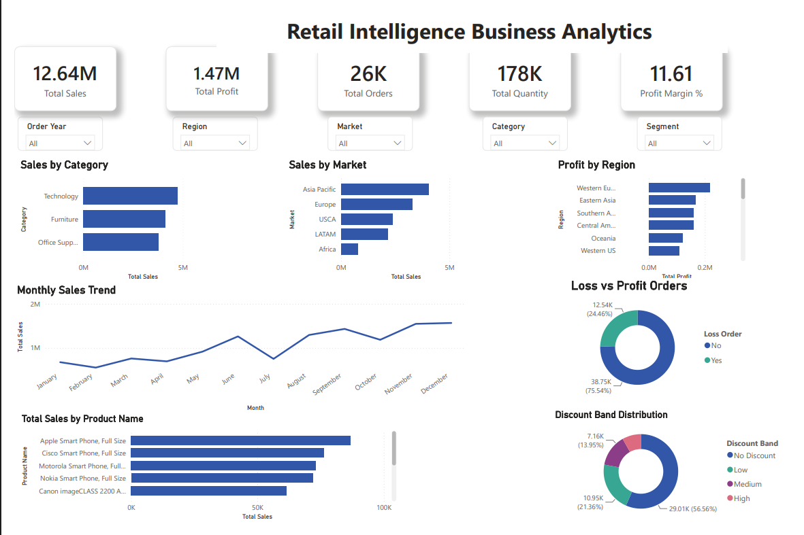

# 📊 Retail Business

<p align="center">


</p>

---

# 📌 Project Overview

An end-to-end **Business Analytics** project that transforms raw retail transaction data into actionable business intelligence using **Python, PostgreSQL, SQL, and Power BI**.

The project demonstrates a complete analytics workflow—from data preprocessing and feature engineering to SQL-based business analysis and interactive dashboard visualization—helping organizations understand sales performance, profitability, customer behavior, discount strategies, and regional trends.

---

# 📌 Business Problem

Retail organizations generate thousands of transactions every day, but raw transactional data alone provides limited business value.

This project addresses key business questions such as:

- Which product categories generate the highest revenue?
- Which products contribute the most profit?
- Which customer segments drive business growth?
- Which regions and markets perform the best?
- How do discounts impact profitability?
- Which transactions result in financial losses?

The resulting insights support data-driven decision-making through structured analytics and interactive reporting.

---

# 🎯 Project Objectives

- Clean and preprocess retail transaction data using Python.
- Engineer business-focused features for deeper analysis.
- Store processed data in PostgreSQL.
- Validate data quality using SQL.
- Perform business analysis through SQL queries.
- Build an interactive Power BI dashboard.
- Generate actionable business insights for stakeholders.

---

# 🛠️ Technology Stack

| Technology | Purpose |
|------------|----------|
| 🐍 Python | Data Cleaning & Feature Engineering |
| 🐼 Pandas | Data Manipulation |
| 🔢 NumPy | Numerical Computing |
| 📊 Matplotlib | Data Visualization |
| 🗄️ PostgreSQL | Database Management |
| 📝 SQL | Business Analytics |
| 📈 Power BI | Interactive Dashboard |
| 🌿 Git & GitHub | Version Control |

---

# 🔄 Project Workflow

```text
             Global Superstore Dataset
                        │
                        ▼
         Data Cleaning & Feature Engineering
                        │
                        ▼
      Exploratory Data Analysis (Python)
                        │
                        ▼
           PostgreSQL Database
                        │
                        ▼
      SQL Validation & Business Analytics
                        │
                        ▼
        Interactive Power BI Dashboard
                        │
                        ▼
     Business Insights & Recommendations
```

---
# 📂 Dataset Overview

**Dataset:** Global Superstore Dataset

The project uses the **Global Superstore** dataset containing retail transactions across multiple markets, customer segments, product categories, and geographic regions.

The dataset includes information related to:

- 👤 Customer Details
- 📦 Order Information
- 🛍️ Product Information
- 💰 Sales & Profit
- 🎯 Discount
- 📊 Quantity
- 🚚 Shipping Details
- 🌍 Geographic Information

To improve analytical capabilities, several business-focused features were engineered during preprocessing, including:

- Delivery Days
- Profit Margin (%)
- Sales Category
- Discount Band
- Loss Order Indicator
- Order Year

---

# 📁 Repository Structure

The repository follows a modular structure, separating each stage of the analytics workflow into independent components for better organization and reproducibility.

```text
Retail-Business/
│
├── data/
│   ├── raw/
│   └── processed/
│
├── notebooks/
│   ├── 01_Data_Understanding.ipynb
│   ├── 02_Data_Quality_Assessment.ipynb
│   ├── 03_Data_Cleaning_and_Feature_Engineering.ipynb
│   └── 04_Sales_and_Profit_Performance_Analysis.ipynb
│
├── sql/
│   ├── 01_database_setup.sql
│   ├── 02_data_validation.sql
│   ├── 03_business_analysis.sql
│   └── 04_advanced_sql.sql
│
├── dashboard/
│   └── Retail_Intelligence_Dashboard.pbix
│
├── images/
│
├── README.md
├── requirements.txt
└── .gitignore
```

---


# 🐍 Python Analytics Pipeline

Python was used to transform raw retail data into a clean, analysis-ready dataset suitable for database storage and business analytics.

### The workflow included:

- ✔ Data Understanding
- ✔ Data Quality Assessment
- ✔ Data Cleaning
- ✔ Missing Value Validation
- ✔ Duplicate Detection
- ✔ Feature Engineering
- ✔ Exploratory Data Analysis
- ✔ Final Processed Dataset Generation

---

# 🗄️ PostgreSQL & SQL Analytics

After preprocessing, the cleaned dataset was imported into **PostgreSQL**, where SQL was used to validate the data and perform business analytics.

### The SQL workflow consisted of four modules:

### 🗄️ Database Setup

- Database Creation
- Table Design
- Data Import

### ✅ Data Validation

- Missing Value Checks
- Duplicate Detection
- Data Quality Validation

### 📊 Business Analysis

- Sales Performance
- Profitability Analysis
- Customer Segmentation
- Regional Performance
- Market Analysis

### 🚀 Advanced SQL

- Window Functions
- Ranking Functions
- Running Totals
- Monthly Trends
- SQL Views

---

# ⭐ Project Highlights

This project demonstrates an end-to-end Business Analytics workflow by integrating multiple technologies into a single solution.

### Key Deliverables

- ✅ Python Data Cleaning & Feature Engineering
- ✅ PostgreSQL Database Integration
- ✅ SQL Business Analytics
- ✅ Advanced SQL Queries
- ✅ Interactive Power BI Dashboard
- ✅ Executive Business Insights
- ✅ Professional Project Documentation

---
# 📊 Interactive Power BI Dashboard

The project concludes with an interactive **Power BI dashboard** that transforms retail transaction data into meaningful business insights.

The dashboard enables business stakeholders to monitor sales performance, profitability, customer behavior, product performance, and regional trends through an intuitive and interactive interface.

### Dashboard Highlights

- 📈 Executive KPI Overview
- 💰 Sales & Profit Analysis
- 🛍️ Category & Sub-Category Performance
- 🌍 Regional & Market Analysis
- 👥 Customer Segment Insights
- 🎯 Interactive Filters & Drill-down Analysis

---

## 📸 Dashboard Preview

<p align="center">

</p>

---

# 💡 Key Business Insights

The analysis generated several valuable business insights, including:

- 📈 Technology products generated the highest overall sales.
- 💰 Higher sales do not always translate into higher profitability.
- 🌍 Sales and profit performance varied significantly across regions and markets.
- 👥 Customer segments contributed differently to overall revenue and profit.
- 🎯 Large discount levels were often associated with reduced profit margins.
- 📊 Interactive dashboards enable faster, data-driven business decision-making.

---

# 🚀 Getting Started

### 1️⃣ Clone the Repository

```bash
git clone https://github.com/Swaransh-Mishra/Retail-Intelligence-Business-Analytics.git
cd Retail-Intelligence-Business-Analytics
```

### 2️⃣ Install Dependencies

```bash
pip install -r requirements.txt
```

### 3️⃣ Project Workflow

1. Execute the Jupyter notebooks in sequence.
2. Import the processed dataset into PostgreSQL.
3. Run the SQL scripts for validation and business analysis.
4. Open the Power BI dashboard to explore the results.

---

# 🔮 Future Improvements

Potential enhancements include:

- 🤖 Sales Forecasting using Machine Learning
- 👥 Customer Segmentation using Clustering
- ☁️ Cloud Database Deployment
- 🔄 Automated ETL Pipeline
- 🌐 Web-based Business Analytics Dashboard
- 📊 Real-time Reporting Integration

---
